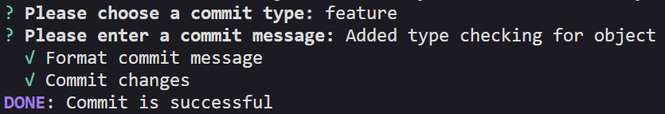

# [`commitify`](https://www.npmjs.com/package/@berakocc/commitify)
> `An NPM CLI for sending commit messages with convenient emojis and format`

## `How to use?`
First install the library in your working directory: 
```bash
npm install @berakocc/commitify
```
Then be sure your directory has git. And you have some changes. After that type below command:
```bash
commitify -p
```
After choosing options result should be like that:



## `Documentation`
For detailed documentation:
```js
commitify --help
```
You can also read [Changelogs](https://github.com/solaristudio/react-on-show/blob/main/changelogs.md) for detailed version updated.

## `Contributing`
Pull requests are welcome. For major changes, please open an issue first to discuss what you would like to change. Also you can help me to improve the library by adding new [issues](https://github.com/solaristudio/react-on-show/issues).
